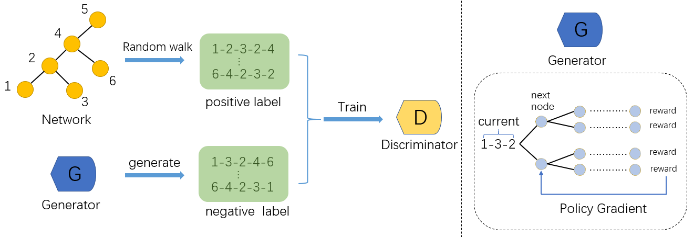

<div align="center">
    <h1>
        WalkGAN
    </h1>
</div>

## Model
<div align="center">
  
</div>

## Basic usage

First:
Installation deepwalk

1. `pip install -r requirements.txt`
2. `python setup.py install`

Second:

We provide example codes using network karate club to run the experiment with default parameters:

```
$ python sequence_gan.py
```
You can change the all the parameters in `sequence_gan.py`.

